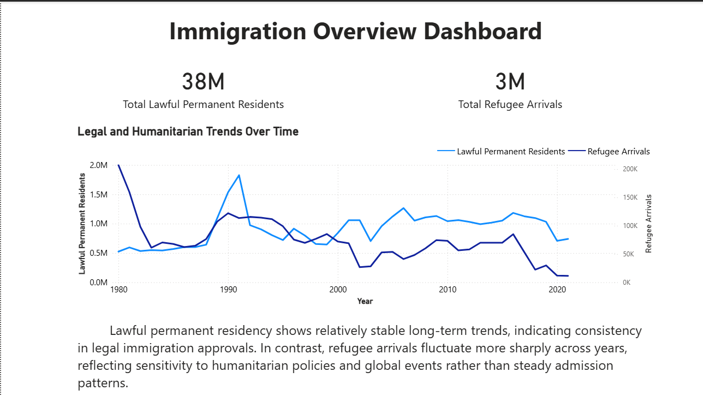
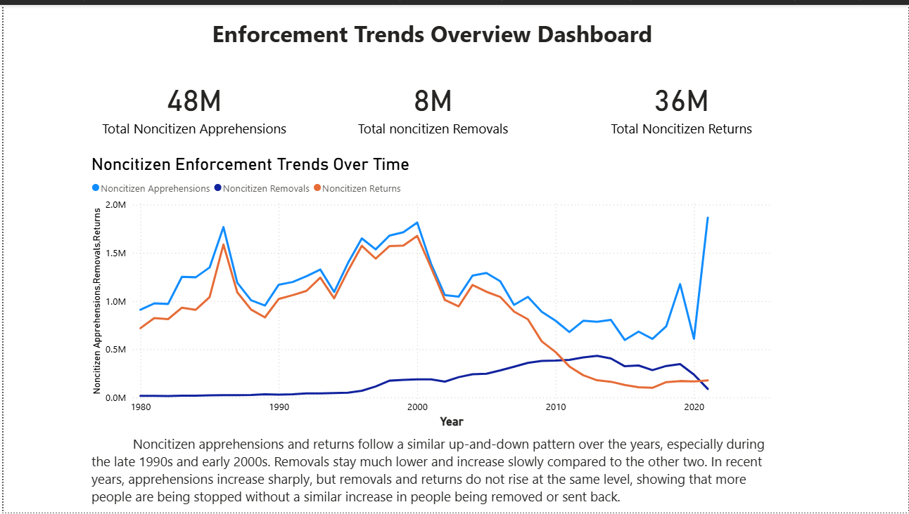

# US Immigration Data Analysis (Power BI)

## Project Overview
This project analyzes long-term trends in U.S. immigration using historical data. The analysis focuses on lawful permanent residents, refugee arrivals, and noncitizen enforcement actions to understand how immigration patterns and enforcement activities have evolved over time.

The project presents insights through interactive Power BI dashboards designed for non-technical stakeholders.

---

## Objective
- Analyze trends in lawful permanent residents and refugee arrivals over time  
- Examine noncitizen enforcement metrics including apprehensions, removals, and returns  
- Identify long-term patterns and fluctuations across immigration categories  
- Communicate insights clearly through visual dashboards  

---

## Dataset
- **Source:** Public U.S. immigration datasets  
- **Time Period:** Approximately 1980–2022  
- **Data Type:** Aggregated annual immigration and enforcement statistics  
- **Data Handling:** Imported locally into Power BI for analysis and visualization  

---

## Tools & Skills Used
- **Power BI**
  - Data modeling
  - DAX measures
  - KPI cards and trend analysis
- **Data Analysis**
  - Trend identification
  - Comparative analysis
- **Data Visualization**
  - Time-series charts
  - Interactive dashboards

---

## Key Insights
- Lawful permanent residency shows relatively stable long-term trends compared to refugee arrivals.
- Refugee arrivals fluctuate more sharply, reflecting sensitivity to humanitarian policies and global events.
- Noncitizen apprehensions and returns follow similar up-and-down patterns, particularly during the late 1990s and early 2000s.
- In recent years, apprehensions have increased sharply without a similar rise in removals or returns, suggesting a growing enforcement gap.

---

## Dashboard Preview

### Immigration Overview Dashboard

### Enforcement Trends Overview Dashboard

---

## Future Enhancements
- Extend analysis using SQL for data extraction and transformation  
- Connect Power BI to cloud databases such as AWS RDS  
- Automate ETL pipelines using cloud storage (AWS S3)  
- Perform deeper exploratory analysis using Python  

---

## Disclaimer
This project is for educational and analytical purposes only and does not represent official government policy or conclusions.
